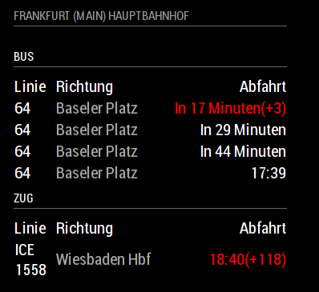
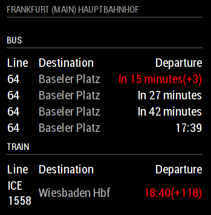

# MMM-RMV

<B>Rhein-Main</b> local transport system (<b>RMV</b>) - Departure Monitor 

After building my own mirror I've realized that there is no module available for my region to display departure times of trams. 
I'm not so familiar with this programming language but after checking the code of other modules I've decided to write my own extension module
for the [MagicMirror2](https://github.com/MichMich/MagicMirror) project by [MichMich](https://github.com/MichMich/).

Please feel free to contact me in case you have questions, comments or improvements.

## Description

The departure monitor displays all leaving trams/busses/trains for a given station. It is necessary to specify the station ID to define the departure station. To define the direction it is also necessary to add the final destination of the trains/busses/trams which you are interested in. The module will not display all departures of a station, only the departures for the given final destinations.

## Version:
v1.0.0:   First Release 
v1.0.1:   IgnoringLines added 
v1.0.2:   Displayed data is splitted into the different transport types 
v1.0.3:   Minor Bug Fixing, 23-0 hour problems, no RTD available, ... 
v1.0.4:   Switch-option added in config to switch between all departures of the station and only interested ones(see Notes and Options) 
v1.0.5:   Ignoring transport types added 
v1.0.5.1: update of Ignoring transport types 
v1.0.6:   maxJourneys added, Bugfixing 
v1.0.7:   Config-option delayLimit added, new color for cancelled connections 
v1.0.8:   Config-options added to reduce height for running multiple instances 
v1.0.9:   Config-options added to reduce Destination Length and to switch between absolute/relativ time 
v1.0.10:  Config-option minT added. If the time [min] until the departure of the connection is below minT it will not be displayed. 
v1.0.11:  Config-option labelDestination added. In case only one fDestination is filled out labelDestination adds the destination to the header. 
v1.0.12:  Replaced deprecated package `request` with `https`. 
<b>Note</b>:

## Translation

This module is available in English (en) and German (de).

## Installation of the module

As similar to other modules:
* Navigate into your `MagicMirror/modules folder`
* `git clone 'https://github.com/Com-Lum/MMM-RMV.git'`
* thats it, you don't need to run `npm install` because no external dependencies are used

## Note

* Multiple instances possible 

* The Header of the module will be automatically chosen according to the station name placed in the config-file 

* If no connection is available or all connections are blocked the module disappears after a few seconds

* If there is an error during data retrieving process it will be shown in the console

* if the train is not on time the line will be displayed in red (can be configured)

* Switch-Option: All departures of the station OR only departures according to the configured "fDestination"'s

## Configuration

<b>Important: "fDestination" does not mean the arrival station which you are interested in!</b> 
<b>It has to be the final destination of the transport line!</b> 
An easy way for finding out the transport routes is to set "fDest" to false and check out what the module is displaying for the different transport types. 

1. minimum configuration within `config.js`

  ... 

    {
        module: 'MMM-RMV',
        position: 'top_right',
        config: {
                apiKey: '', // see chapter below
                stationId: '3000001', // for example: '3000001' - 'Frankfurt (Main) Hauptwache'
                fDestination1: 'Wiesbaden Hauptbahnhof', // for example 'Wiesbaden Hauptbahnhof' for S8/S9'
        }
    }
   
 ...

With this configuration at least the S8/S9 trains should appear demonstrating that not the end point of the journey is important but the final station of the train.
 
2. Configuration including optional parameters within `config.js`:
   
 ...
   
    {
        module: 'MMM-RMV',
        position: 'top_right',
        config: {
		apiKey: '', // see chapter below
		stationId: '',
		labelStation: true, // adds the departure station as header
		labelDestination: false // adds the destination name to the header (only works with one fDestination)
		labelType: true, // adds a line with the connection type (for each type)
		labelRow: true,
		relativTime: true, // false: alsways absolute time see also relT
		reduceD: false, // reduces length of destination name
		delayLimit: 0, // all delays above this limit will be displayed in red with the delay in brackets
		fDest: 'true', // see chapter below
		fDestination1: '', 
		fDestination2: '', // The final destination of the train will be displayed for each line.
		fDestination3: '', 
		fDestination4: '', 
		fDestination5: '',
		lines: '', // These lines will be ignored
		Ctype: '', // These transport types will be ignored "Tram,Bus,Sub,Train,Unk"
		showblocked: false, // Show the blocked transport types/lines in a separate line
		maxC: 15, // maximum displayed connections (standard = 15) out of the requested Journeys
		maxT: 60, // maximum time frame for the listed connections
		minT: 0, // if time in minutes until departure drops below this value the connection will not be displayed
		maxJ: 50, // requested connections from server (includes all departures for the current station)
        	updateInterval: '1 * 60 * 1000' // default: once per minute
		relT: 45, // uses absolute time above limit
        }
    }
    
  ...
    
## Station ID and apiKey

An apiKey has to be requested at [RMV - opendata](https://opendata.rmv.de/site/start.html). 
The stationId can be found in file 'StationID.txt' or at [RMV - opendata](https://opendata.rmv.de/site/start.html). 	
The correct station name is in column 'E'. 
<b>Note</b>: The stations have to be added in german only.

## Config Options

| **Option** | **Default** | **Description** |
| :---: | :---: | --- |
| stationId | |  Choose your departure station <EM> for example value: '3000001' - 'Frankfurt (Main) Hauptwache'</EM>
 |
| labelStation `optional` | true |   Show or hide header with departure station name   
 |
| labelDestination `optional` | false |   Adds the destination name to the header (only works with one fDestination)   
 |
| labelType `optional` | true |   Show or hide a line for each connection type (only available connections)  
 |
| labelRow `optional` | true |   Show or hide column headers  
 |
| relativTime `optional` | true |   switches off relative time (if relT = 0 completely, else above 'relT' limit)  
 |
| reduceD `optional` | false |   Reduces the Length of the destination name  
 |
| delayLimit `optional` | 0 |   all delays above this limit will be displayed in red and delay in brackets  
 |
| fDest `optional`| true |  true: only departures with final destination specified in the "fDestination"'s.  false: all departures of the station will be shown
 |
| fDestination1 | |  The final stop of the train line has to be added here! (station name) <EM>for example value: 'Frankfurt (Main) Südbahnhof'</EM>
 |
| fDestination2 | |  The final stop of the train line has to be added here! (station name) <EM>default value: 'Wiesbaden Hauptbahnhof'</EM>
 |
| fDestination3 `optional` | |  The final stop of the train line has to be added here! (station name) |
| fDestination4 `optional` | |  The final stop of the train line has to be added here! (station name) |
| fDestination5 `optional` | |  The final stop of the train line has to be added here! (station name) |
| lines `optional` |  |   Specific lines will be ignored (add commas between the lines)(For all trams with number >9 a "Tram" needs to be added before the number) <EM> Example: 'S8, S1,Tram11'  </E>
 |
| Ctype `optional` |  |   Specific transport types will be ignored (add commas between the types) <EM> Example: 'Tram, Train,Sub,Bus,Unk'  </E>
 |
| showblocked `optional` | false |   Show or hide a line with all blocked transport types/lines  
 |
| maxC `optional` | 15 |  Maximum displayed lines  <EM><B>Note</B>: only the lines within a time frame of 1 hours (default) will be displayed. If there less lines than the limit only the available lines will be displayed</EM>
 |
| maxT `optional` | 60 |  Displayed Time Frame  <EM><B>Note</B>: only the lines within this time frame will be displayed.</EM>
 |
| minT `optional` | 0 |  Displayed Time Frame  <EM><B>Note</B>: If the time in minutes until departure drops below this value it will not be displayed</EM>
 |
| maxJ `optional` | 50 |  Maximum requested lines  <B>Only for stationID's which are main transport hubs</B>  <EM><B>Note</B>: In case of many incoming trains in a short time the limit for requested connections can be increased in order to show more rare routes up to the limits  of MaxC and MaxT</EM>
 |
| relT `optional` | 45 |   switches to absolute time above limit (see also 'relativTime'  
 |
| updateInterval `optional`  | '60000' |   Update interval in milliseconds  <EM> default: Once per minute </EM>
 |

## Screenshots

## Licence
MIT License

Copyright (c) 2022 Com-Lum (https://github.com/Com-Lum/)

Permission is hereby granted, free of charge, to any person obtaining a copy
of this software and associated documentation files (the "Software"), to deal
in the Software without restriction, including without limitation the rights
to use, copy, modify, merge, publish, distribute, sublicense, and/or sell
copies of the Software, and to permit persons to whom the Software is
furnished to do so, subject to the following conditions:

The above copyright notice and this permission notice shall be included in all
copies or substantial portions of the Software.

THE SOFTWARE IS PROVIDED "AS IS", WITHOUT WARRANTY OF ANY KIND, EXPRESS OR
IMPLIED, INCLUDING BUT NOT LIMITED TO THE WARRANTIES OF MERCHANTABILITY,
FITNESS FOR A PARTICULAR PURPOSE AND NONINFRINGEMENT. IN NO EVENT SHALL THE
AUTHORS OR COPYRIGHT HOLDERS BE LIABLE FOR ANY CLAIM, DAMAGES OR OTHER
LIABILITY, WHETHER IN AN ACTION OF CONTRACT, TORT OR OTHERWISE, ARISING FROM,
OUT OF OR IN CONNECTION WITH THE SOFTWARE OR THE USE OR OTHER DEALINGS IN THE
SOFTWARE.
